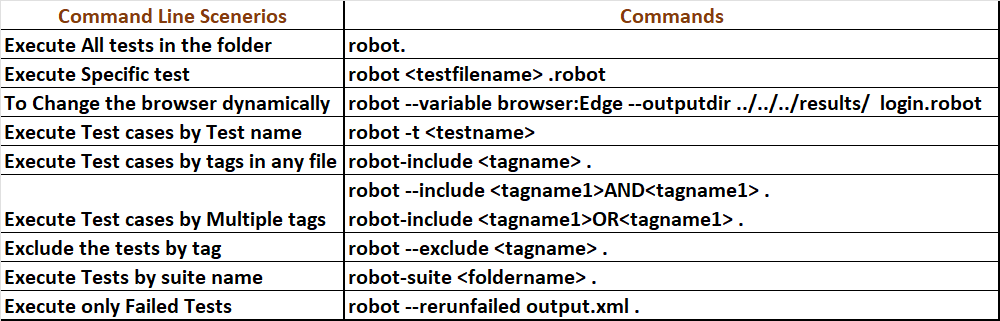

#Login Page Automation Demo With the help of Robotframework

#Information
I have used the robotframework to automate this login page,
the page link is: https://www.saucedemo.com/v1/

#project Cloning
If you want to clone this project you need the required dependencies 
you can simply run pip install -r requirements.txt in your command prompt

#Result folder
All the results are stored in the results directory

#Key Points to Note: To import the source make sure to provide the absolute path like
../../../resources/keywords.robot else you will encounter the error as File not found
  1. ../ --> Mean go one step back in directory\

  2. If you need to run the framework wuth the csv file need to have pycharm plugin
     csv editor

#Some Command to run the test
